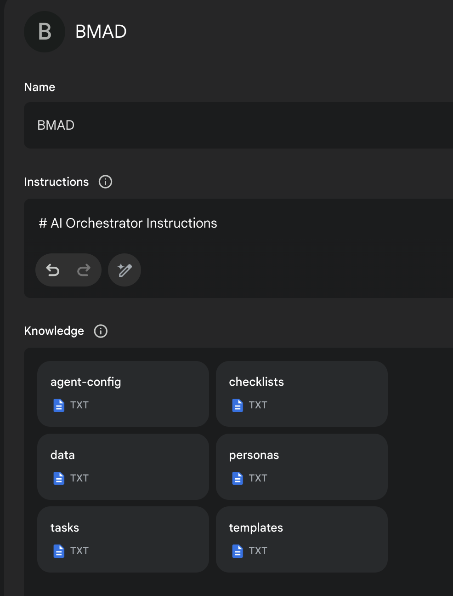

# Phương Pháp BMAD 3.1 (Phương Pháp Đột Phá của Phát Triển Agile Điều Khiển bởi AI)

Phiên Bản Cũ:
[Phiên Bản 1](https://github.com/bmadcode/BMAD-METHOD/tree/V1)
[Phiên Bản 2](https://github.com/bmadcode/BMAD-METHOD/tree/V2)

## Hãy Làm Điều Này Trước, Và Mọi Thứ Sẽ Trở Nên Dễ Hiểu

Có rất nhiều tài liệu ở đây, nhưng tôi KHUYẾN KHÍCH BẠN chỉ cần thử Web Agent - chỉ mất vài phút để thiết lập trong Gemini - và bạn có thể sử dụng BMad Agent để giải thích cách hoạt động của phương pháp này, cách thiết lập trong IDE, cách thiết lập trên Web, những gì nên làm trên web hoặc ide (mặc dù bạn cũng có thể chọn con đường riêng của mình!) - tất cả chỉ bằng cách trò chuyện với bmad agent!

### Thiết Lập Nhanh Dự Án Web (Được Khuyến Nghị)

Orchestrator Uber BMad Agent có thể làm tất cả - đã được biên dịch sẵn trong thư mục `web-build-sample`.

- Nội dung của [Mẫu Prompt Agent](web-build-sample/agent-prompt.txt) được dán vào trường 'Instructions' của Gemini Gem hoặc ChatGPT customGPT.
- Các file còn lại trong cùng thư mục đó chỉ cần được đính kèm như trong ảnh chụp màn hình bên dưới. Đặt tên cho nó (chẳng hạn như BMad Agent) và lưu lại, và giờ bạn đã có BMad Agent sẵn sàng để giúp bạn brainstorm, nghiên cứu, lập kế hoạch, thực hiện tầm nhìn của bạn, hoặc hiểu cách thức hoạt động của tất cả!
- Khi nó đang chạy, bắt đầu bằng cách gõ `/help`, sau đó gõ lựa chọn `2` khi nó hiển thị 3 tùy chọn để tìm hiểu về phương pháp này!

[Thêm Tài Liệu, Giải Thích, và Chi Tiết IDE](docs/readme.md) có sẵn tại đây!

## Kết Thúc

Quan tâm đến việc cải thiện Phương Pháp BMAD? Xem [hướng dẫn đóng góp](docs/CONTRIBUTING.md).

Cảm ơn và chúc bạn thích thú - BMad!
[Giấy Phép](docs/LICENSE)